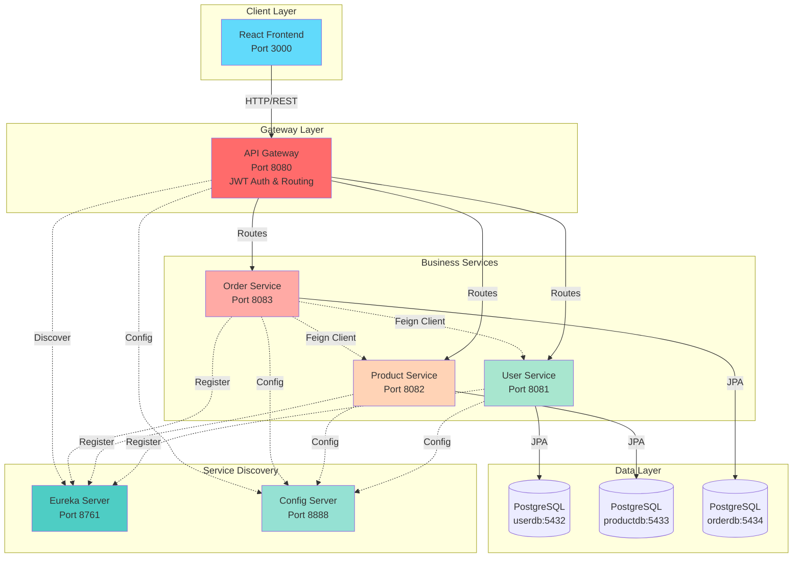
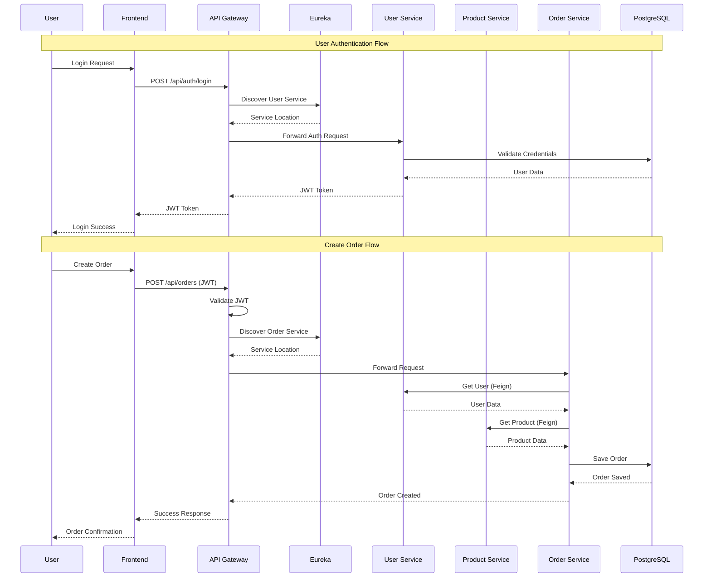
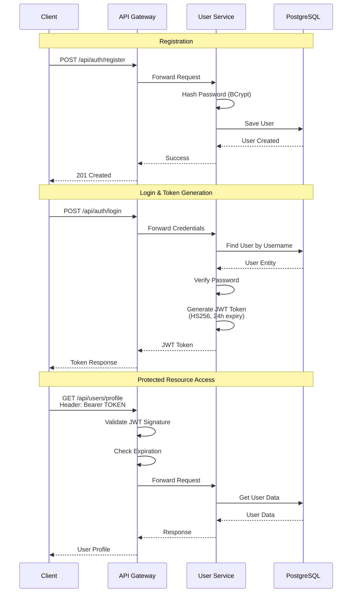
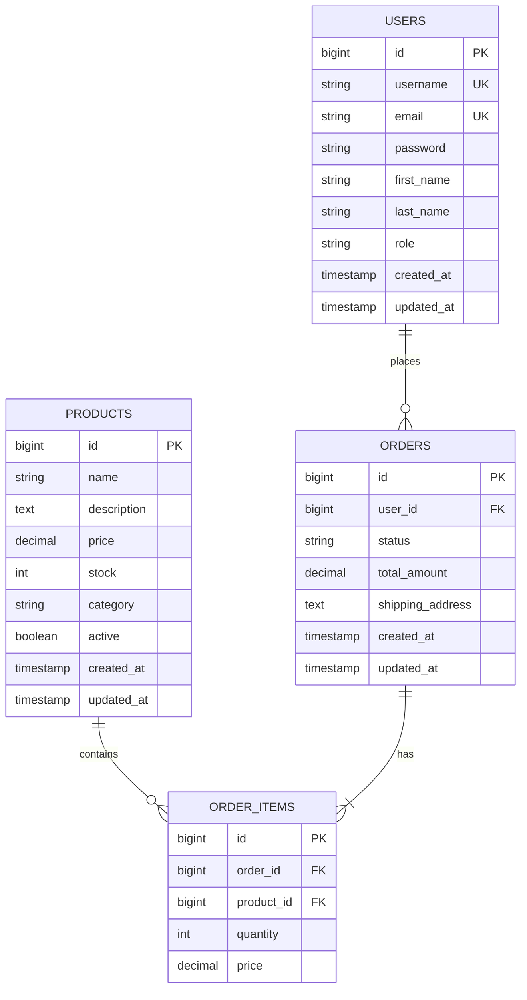
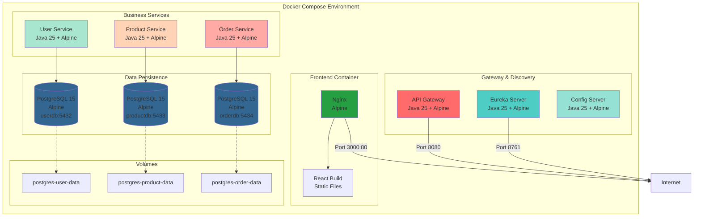
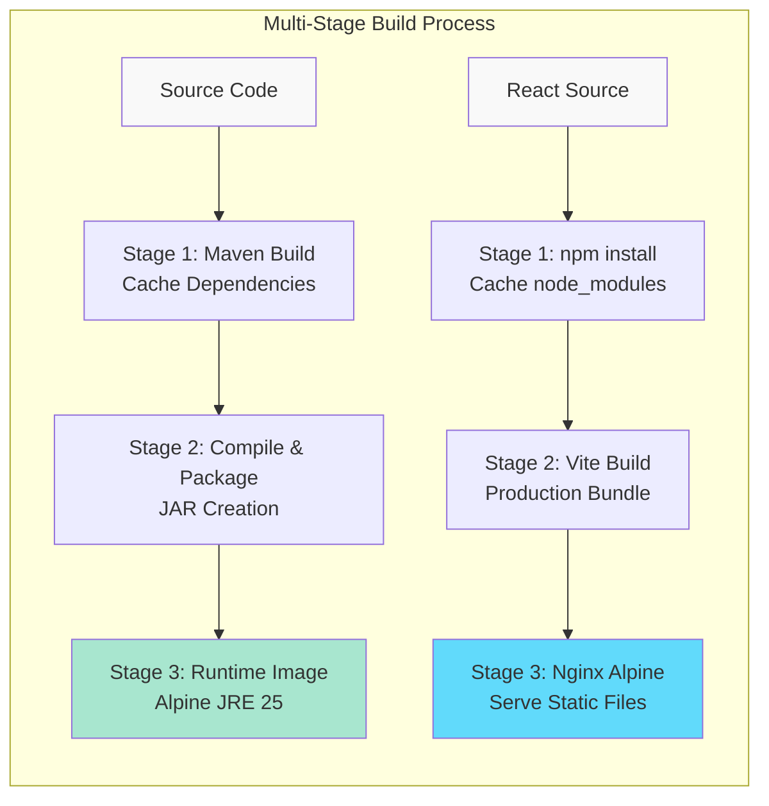

# Enterprise Microservices Application

Полноценное микросервисное приложение с Java Spring Boot backend и React frontend с 3D визуализацией.

## 🏗️ Архитектура



### Backend Микросервисы (Spring Boot 3.4.10)

1. **Config Server** (Port 8888)
   - Централизованная конфигурация для всех сервисов
   - Spring Cloud Config

2. **Eureka Server** (Port 8761)
   - Service Discovery
   - Регистрация и обнаружение микросервисов
   - Health checks

3. **API Gateway** (Port 8080)
   - Маршрутизация запросов
   - JWT аутентификация
   - CORS настройки
   - Rate limiting

4. **User Service** (Port 8081)
   - Регистрация и аутентификация пользователей
   - JWT token generation
   - Управление профилями
   - PostgreSQL database (userdb)

5. **Product Service** (Port 8082)
   - CRUD операции для продуктов
   - Пагинация и фильтрация
   - Поиск по категориям
   - PostgreSQL database (productdb)

6. **Order Service** (Port 8083)
   - Создание и управление заказами
   - История заказов
   - Интеграция с User и Product Service через Feign Client
   - PostgreSQL database (orderdb)

### Frontend (React 18 + Vite 6)

- **Технологии:**
  - React 18.3
  - Vite 6.0
  - React Router v7.8
  - Axios
  - Zustand (state management)
  - TanStack Query v5 (React Query)
  - TailwindCSS 3.4
  - React Hook Form
  - Lucide Icons
  - **Three.js 0.171** - 3D графика
  - **@react-three/fiber** - React renderer для Three.js
  - **@react-three/drei** - Helpers для Three.js
  - **Framer Motion 12** - Анимации

- **Страницы:**
  - Home - Главная страница с 3D hero scene
  - Demo - Showcase 3D компонентов и анимаций
  - Login/Register - Аутентификация
  - Products - Каталог продуктов с анимациями
  - ProductDetail - Детали продукта с 3D моделью
  - Orders - История заказов
  - Profile - Профиль пользователя

- **3D Компоненты:**
  - `HeroScene3D` - 3D сцена для главной страницы
  - `FloatingIcons3D` - Анимированные 3D иконки
  - `ProductModel3D` - 3D модели продуктов

- **Анимационные Компоненты:**
  - `AnimatedCard` - Карточки с анимацией
  - `FadeInSection` - Плавное появление секций
  - `GradientOrb` - Анимированные градиентные сферы
  - `PageTransition` - Переходы между страницами
  - `ParticleBackground` - Фоновые частицы

## 🚀 Быстрый старт

### Предварительные требования

- Docker и Docker Compose
- Java 17+ (для локальной разработки)
- Node.js 18+ (для локальной разработки)
- Maven 3.8+ (для локальной разработки)

### Запуск через Docker Compose

```bash
# Клонировать репозиторий
cd /home/rachi/Documents/Project/Windsurf/Enterprise

# Включить BuildKit для оптимизированной сборки (рекомендуется)
export DOCKER_BUILDKIT=1
export COMPOSE_DOCKER_CLI_BUILD=1

# Собрать и запустить все сервисы
docker-compose up --build -d

# Просмотр логов
docker-compose logs -f

# Остановить все сервисы
docker-compose down

# Остановить и удалить volumes
docker-compose down -v
```

**⚡ Оптимизация сборки:**
- Первая сборка: ~15-20 минут
- Повторная сборка (изменения кода): ~3-5 минут (**70% быстрее**)
- См. [BUILD_QUICK_START.md](./BUILD_QUICK_START.md) и [DOCKER_OPTIMIZATION.md](./DOCKER_OPTIMIZATION.md)

### Порядок запуска сервисов

1. PostgreSQL databases (автоматически)
2. Config Server
3. Eureka Server
4. User Service, Product Service, Order Service
5. API Gateway
6. Frontend

**Время полного запуска:** ~2-3 минуты

## 📡 API Endpoints

### Authentication (User Service)

```
POST /api/auth/register - Регистрация
POST /api/auth/login    - Вход
```

### Users (User Service)

```
GET    /api/users           - Получить всех пользователей (Admin)
GET    /api/users/{id}      - Получить пользователя по ID
GET    /api/users/username/{username} - По username
PUT    /api/users/{id}      - Обновить пользователя
DELETE /api/users/{id}      - Удалить пользователя (Admin)
```

### Products (Product Service)

```
GET    /api/products                    - Все продукты (пагинация)
GET    /api/products/active             - Активные продукты
GET    /api/products/{id}               - Продукт по ID
GET    /api/products/category/{category} - По категории
GET    /api/products/search?name=...    - Поиск по имени
POST   /api/products                    - Создать продукт
PUT    /api/products/{id}               - Обновить продукт
DELETE /api/products/{id}               - Удалить продукт
PATCH  /api/products/{id}/stock         - Обновить stock
```

### Orders (Order Service)

```
GET    /api/orders                  - Все заказы (пагинация)
GET    /api/orders/{id}             - Заказ по ID
GET    /api/orders/user/{userId}    - Заказы пользователя
GET    /api/orders/user/{userId}/history - История заказов
POST   /api/orders                  - Создать заказ
PATCH  /api/orders/{id}/status      - Обновить статус
DELETE /api/orders/{id}             - Отменить заказ
```

## 🔄 Data Flow



## 🔐 Аутентификация

Приложение использует JWT токены для аутентификации.



### Получение токена

```bash
curl -X POST http://localhost:8080/api/auth/login \
  -H "Content-Type: application/json" \
  -d '{
    "username": "testuser",
    "password": "password123"
  }'
```

### Использование токена

```bash
curl -X GET http://localhost:8080/api/users/1 \
  -H "Authorization: Bearer YOUR_JWT_TOKEN"
```

## 🌐 Доступ к сервисам

- **Frontend:** http://localhost:3000
- **API Gateway:** http://localhost:8080
- **Eureka Dashboard:** http://localhost:8761
- **User Service:** http://localhost:8081
- **Product Service:** http://localhost:8082
- **Order Service:** http://localhost:8083
- **Config Server:** http://localhost:8888

### Swagger UI

- User Service: http://localhost:8081/swagger-ui.html
- Product Service: http://localhost:8082/swagger-ui.html
- Order Service: http://localhost:8083/swagger-ui.html

## 🗄️ База данных



### PostgreSQL Instances

- **User DB:** localhost:5432 (userdb)
- **Product DB:** localhost:5433 (productdb)
- **Order DB:** localhost:5434 (orderdb)

**Credentials:**
- Username: postgres
- Password: postgres

### Подключение к БД

```bash
# User DB
docker exec -it postgres-user psql -U postgres -d userdb

# Product DB
docker exec -it postgres-product psql -U postgres -d productdb

# Order DB
docker exec -it postgres-order psql -U postgres -d orderdb
```

## 📦 Структура проекта

```
Enterprise/
├── backend/
│   ├── config-server/
│   ├── eureka-server/
│   ├── api-gateway/
│   ├── user-service/
│   ├── product-service/
│   └── order-service/
├── frontend/
│   └── react-app/
├── docker-compose.yml
└── README.md
```

## 🛠️ Локальная разработка

### Backend

```bash
# Каждый сервис запускается отдельно
cd backend/user-service
mvn spring-boot:run

# Или через IDE (IntelliJ IDEA, Eclipse)
```

### Frontend

```bash
cd frontend/react-app

# Установка зависимостей
npm install

# Запуск dev сервера
npm run dev

# Build для production
npm run build
```

## 🔧 Конфигурация

### Backend

Конфигурация находится в `application.yml` каждого сервиса.

**Важные параметры:**
- JWT Secret: `your-secret-key-must-be-at-least-256-bits-long-for-HS256-algorithm`
- JWT Expiration: 86400000ms (24 часа)

### Frontend

Создайте `.env` файл:

```env
VITE_API_URL=http://localhost:8080/api
```

## 📊 Мониторинг

### Actuator Endpoints

Все сервисы имеют Spring Boot Actuator:

```
/actuator/health   - Health check
/actuator/info     - Информация о сервисе
/actuator/metrics  - Метрики
```

### Eureka Dashboard

Мониторинг всех зарегистрированных сервисов:
http://localhost:8761

## 🧪 Тестирование API

### Пример: Создание пользователя и заказа

```bash
# 1. Регистрация
curl -X POST http://localhost:8080/api/auth/register \
  -H "Content-Type: application/json" \
  -d '{
    "username": "john",
    "email": "john@example.com",
    "password": "password123",
    "firstName": "John",
    "lastName": "Doe"
  }'

# 2. Создание продукта
curl -X POST http://localhost:8080/api/products \
  -H "Content-Type: application/json" \
  -H "Authorization: Bearer YOUR_TOKEN" \
  -d '{
    "name": "Laptop",
    "description": "High-performance laptop",
    "price": 999.99,
    "stock": 50,
    "category": "Electronics",
    "active": true
  }'

# 3. Создание заказа
curl -X POST http://localhost:8080/api/orders \
  -H "Content-Type: application/json" \
  -H "Authorization: Bearer YOUR_TOKEN" \
  -d '{
    "userId": 1,
    "items": [
      {
        "productId": 1,
        "quantity": 2
      }
    ],
    "shippingAddress": "123 Main St, City"
  }'
```

## 🐛 Troubleshooting

### Сервис не запускается

```bash
# Проверить логи
docker-compose logs service-name

# Перезапустить сервис
docker-compose restart service-name
```

### База данных не доступна

```bash
# Проверить статус PostgreSQL
docker-compose ps

# Пересоздать volumes
docker-compose down -v
docker-compose up -d
```

### Frontend не подключается к API

1. Проверьте `.env` файл
2. Убедитесь что API Gateway запущен
3. Проверьте CORS настройки в Gateway

## 🚢 Deployment Architecture



### Build Optimization



**Оптимизации:**
- ✅ BuildKit для параллельной сборки
- ✅ Multi-stage builds (размер образов -37%)
- ✅ Layer caching для зависимостей
- ✅ Alpine images для минимального размера
- ✅ Первая сборка: ~15-20 мин, повторная: ~3-5 мин (70% быстрее)

## 📝 Технологический стек

### Backend

- **Java 25** (Oracle JDK)
- **Spring Boot 3.4.10**
- **Spring Cloud 2024.0.0**
- Spring Security + JWT 0.12.3
- Spring Data JPA
- **PostgreSQL 15** (Alpine)
- **MapStruct 1.5.5**
- Lombok
- OpenAPI/Swagger
- Maven 3.9+

### Frontend

- **React 18.3**
- **Vite 6.0**
- **React Router 7.8**
- Axios 1.7
- Zustand 5.0
- **TanStack Query 5.62**
- **TailwindCSS 3.4**
- React Hook Form 7.54
- **Lucide Icons 0.469**
- **Three.js 0.171**
- **@react-three/fiber 8.17**
- **@react-three/drei 9.117**
- **Framer Motion 12.23**
- **Playwright 1.56** (E2E Testing)

### DevOps

- Docker with BuildKit
- Docker Compose 3.8
- Multi-stage builds
- Layer caching optimization
- **Nginx Alpine** (Frontend)
- **Alpine Linux** (All containers)

## 🎯 Особенности

### Backend

- ✅ Микросервисная архитектура
- ✅ Service Discovery (Eureka)
- ✅ API Gateway с JWT аутентификацией
- ✅ Централизованная конфигурация
- ✅ Межсервисная коммуникация (Feign Client)
- ✅ Clean Architecture
- ✅ DTO Pattern
- ✅ Global Exception Handling
- ✅ Валидация данных
- ✅ Пагинация
- ✅ Swagger документация
- ✅ Health checks & Actuator endpoints

### Frontend

- ✅ **3D визуализация** (Three.js + React Three Fiber)
  - Интерактивные 3D сцены
  - Анимированные 3D модели продуктов
  - Floating 3D иконки
- ✅ **Продвинутые анимации** (Framer Motion)
  - Page transitions
  - Animated cards
  - Gradient orbs
  - Particle backgrounds
  - Fade-in sections
- ✅ Responsive UI (Mobile-first)
- ✅ Protected routes с JWT
- ✅ State management (Zustand)
- ✅ API caching & optimistic updates (TanStack Query)
- ✅ Modern React patterns (Hooks, Context)
- ✅ Form validation (React Hook Form)
- ✅ **E2E Testing** (Playwright)

### DevOps

- ✅ Оптимизированная Docker сборка (BuildKit)
- ✅ Multi-stage builds с кэшированием
- ✅ Минимальные runtime образы (Alpine)
- ✅ Автоматическое кэширование зависимостей
- ✅ Параллельная сборка сервисов
- ✅ Уменьшенный размер образов (~37%)
- ✅ Health checks для всех сервисов
- ✅ Volume persistence для баз данных

## 📄 Лицензия

MIT License

## 👨‍💻 Автор

Enterprise Microservices Project
